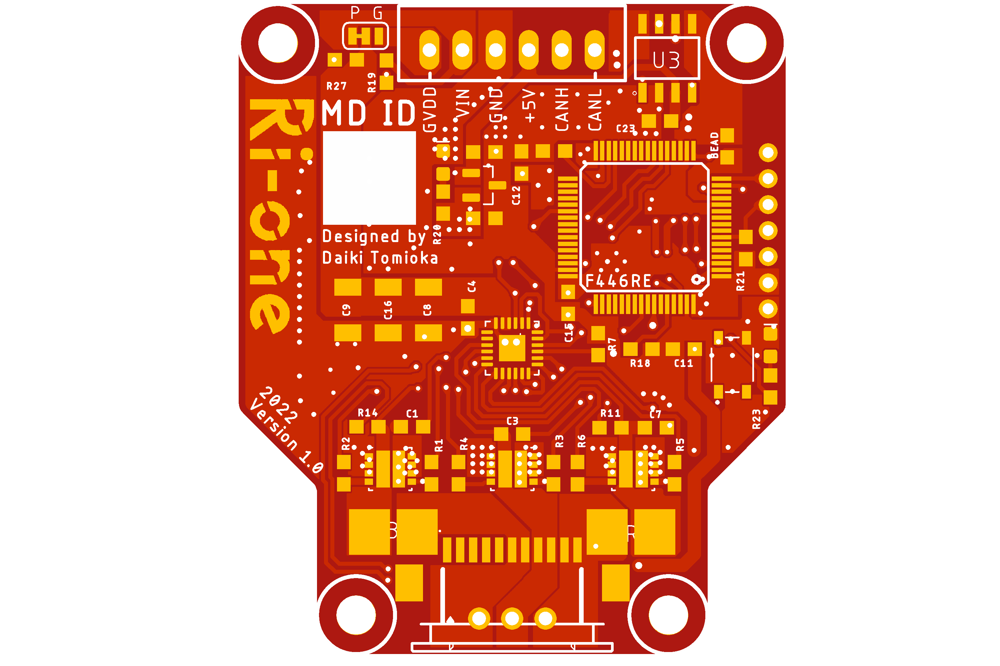

# Ri-one BLDC Driver V1

|  | IC |
| --- | --- |
| MOSFET | [SIZ254DT-T1-GE3](https://www.mouser.jp/ProductDetail/Vishay-Siliconix/SIZ254DT-T1-GE3?qs=pUKx8fyJudCKVjpWQE2G2A%3D%3D) |
| MCU | [STM32F446RET6](https://jp.rs-online.com/web/p/microcontrollers/1106621) |
| Gate Driver | [DVR8300DRGER](https://www.ti.com/product/DRV8300/part-details/DRV8300DRGER) |
| CAN Transceiver | [TJA1441AT](https://akizukidenshi.com/catalog/g/gI-17464/) |
| Shunt Resistor| 10mΩ | 
| 3.3V Regulator | [AP7333-33SAG](https://akizukidenshi.com/catalog/g/gI-11360/) |
| Motor | [EC 45 flat 30W](https://www.maxongroup.com/medias/sys_master/root/8846629470238/20-JP-285.pdf)|

---

初めて作ったモータドライバ基板です．
記事も書いたので，良かったら見てください．
[tomixrm 初のモタドラ設計！！ゲート抵抗を計算して求めてみた](https://tomixrm.vercel.app/2e7cb67096e143f2a43334a63c00d47e)